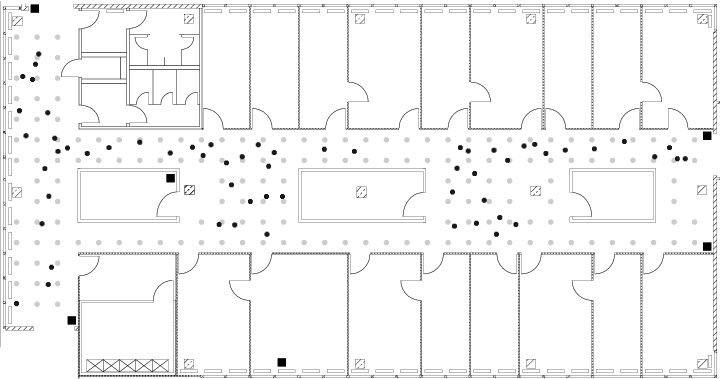
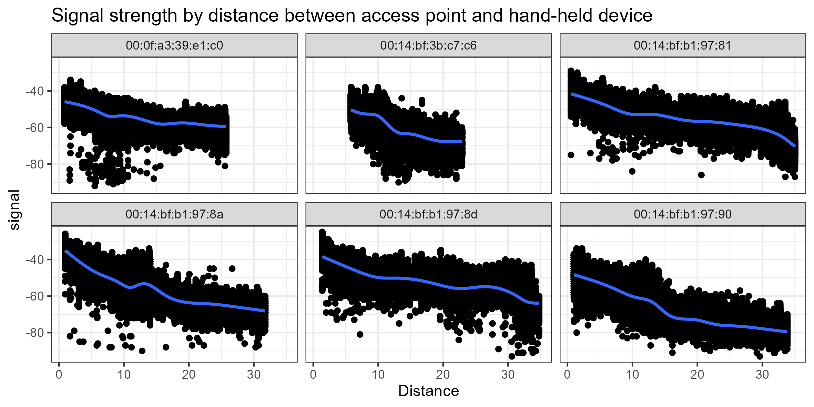
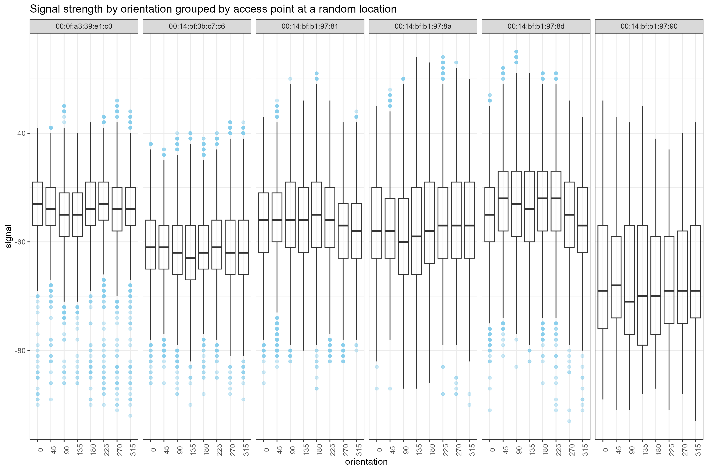
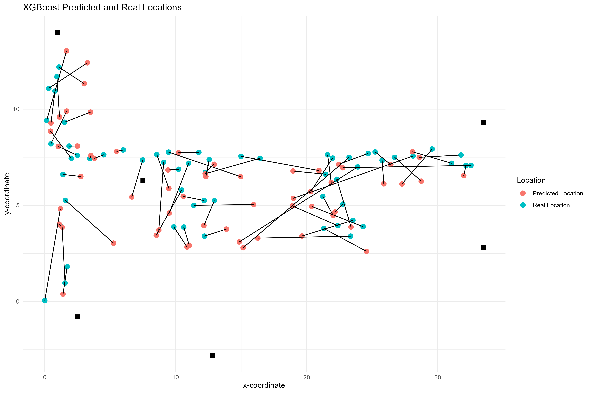
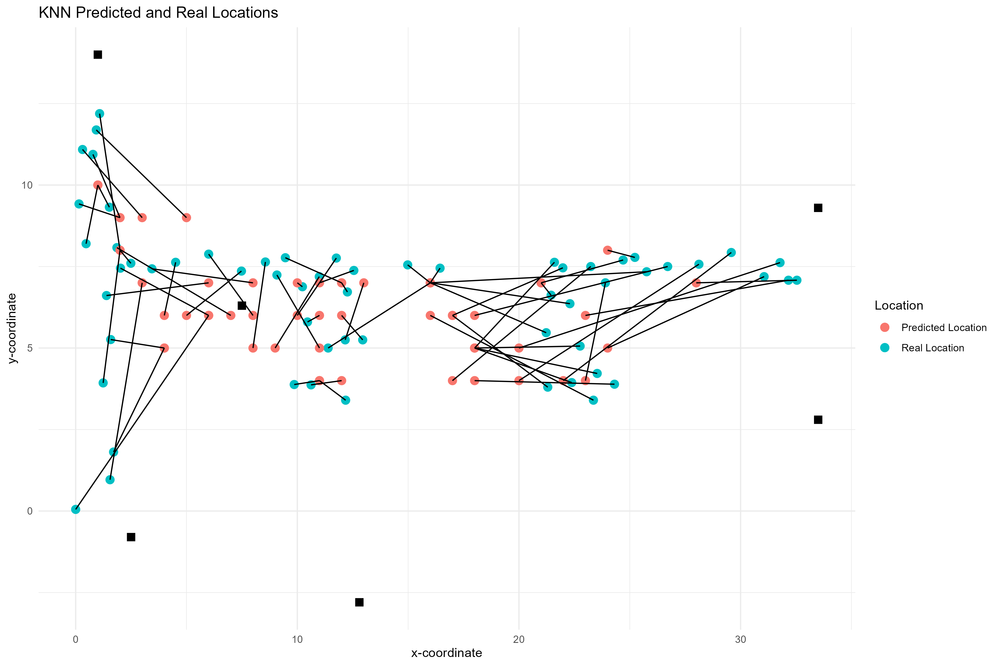

```{r setup, include=FALSE}
knitr::opts_chunk$set(echo = FALSE)
```

\newpage

# 1. Executive Summary

This project summarizes the findings and recommendations of an indoor positioning system (IPS) using Wi-Fi strength signals. 

The primary objective is to implement a robust model that can accurately predict the location of a device connected to the local Wi-Fi network. We implemented two supervised machine learning methods (XGBoost and K-Nearest Neighbors) to create two separate models. Notably, both models show predictive skills with a mean error under 2.5 meters for K-Nearest Neighbors, and 1.7 for XGBoost. Not only XGBoost demonstrated to have better accuracy in the predictions, but has also the advantage of being computationally efficient. Further accuracy can be obtained by optimizing the location of the routers inside the building to ensure an even distribution of the signals. This recommendation is easy and cost-effective to implement. 


\newpage

# 2. Introduction and Background

Indoor position systems (IPS) development is an active area of research with multiple applications ranging from medical settings to security. Problems associated with tracking indoor location include low accuracy from traditional GPS systems due to problems in signal propagation^[1]^. An alternative comes from using Wi-Fi signal strength to triangulate the position of a device. The existence of numerous public and private Wi-Fi networks in buildings, makes this approach highly practical.


Limitations to this approach include the decreasing strength as the device moves away from the source, the high sensitivity of the orientation of the device to the reception of Wi-Fi signals^[2]^, and noise introduced by other access points. Other facotrs include building layouts and construction material. 

Specifically for orientation, some positions allow for a direct line of connectivity between the router and the receiver, while others, the user's body might form an obstruction^[3]^.

The problem to solve to develop an IPS can be summarized as the following question: "Given a set of signatures (signal strength) from nearby Wi-Fi routers at a given device orinetation, and considering the decay of the distance with signal, what's the location?. 

This type of problem, in which the desired outcome, in this case location, is explicitly stated as some part of the dataset, allows the use of supervised machine learning (SML). SML to put it simply, takes features from the data (variables believe to have a relationship with the response), to predict the answer. In this case, we use features such as signal strength and orientation to predict positions x, y in the grid. To validate and test a model the data is typically divided into "training data" and "testing data". Training data is used to develop a model that can predict location and then, its accuracy with unseen data is assessed with the testing data. A high accuracy in the training data and low on the testing means that the model is not able to find general patterns applicable to other observations. This level of accuracy can also be understood as one that minimizes the error between the values predicted by the model and the real ones.The average difference of this error is known as Mean Average Error (MAE), which we use to validate our model. Because this metric is measuring the difference between the predicted values and the real values, a good model will have a low MAE.


\newpage

# 3. Data


The following section, describes and characterizes the data set provided by the client. 

The client gridded 540 m^2^ of their building into 166, 1-meter-by-1-meter cells in which measurements of signal strength from 6 access points (Wi-Fi routers) were obtained from a handheld device connected to a local Wi-Fi network (Fig. 1). The data are subdivided into two sub-sets, “offline” and “online”, distinguished by the fact that the offline data set was sampled at fixed locations and orientations, versus the online data set that was sampled at random locations and orientations.

The offline data, intended to train a model, was collected at all the 166 fixed points within the grid. At each location, the device was oriented in 45-degree increments, starting from 0 up to 360 degrees, resulting in 8 angles (i.e., 0, 45, 90, 135, 180, 225, 270, and 315). Signal strength for the access points was measured for each orientation a total of 110 times, totaling 880 samples per location and a total of 146,080 observations.


```{r fig_1, fig.align = "center", fig.cap= 'Floor plan of the client’s building where the data was collected. Dots mark the locations for the data sampling. Black dots correspond to the offline locations, and grey dots correspond to the online data locations. Black squares are the 6 access points in the building. Note the gridded area is confined to locations outside the rooms.', out.width="50%", out.height="50%"}

 

```


The online data was designed to simulate real-world data, where devices are held at random orientations and are not bound to the center of a grid point. 60 locations were randomly selected and the device was then oriented at a random angle. Similarly, to the offline data set, signal strength for the access points was measured 110 times, resulting in a total of 6600 observations in total.


The data is composed by 8 variables from which we remove those with redundant or non-relevant information after the data exploration and only keep:

1) Orientation: The scanning device’s orientation at binned 45 degrees increments.
2) Mac: The IP address of the access points.
3) Signal: Signal strength in decibel-milliwatts.
4) PosX and PosY: x and y coordenates in the grid.

The data exploration also reveals an inverse relationship between signal strength and distance to an access point (Fig 2), and the influence of orienttion on signal strength (Fig. 3).

```{r fig_2, echo=FALSE, message = FALSE,  echo=FALSE, message =FALSE, fig.align = "center", fig.cap= 'Scatter-plot of signal vs distance grouped by access point. Signal strength is inversely related to distance. Some access point have consistent lower signal strengths', out.width="100%", out.height="100%", warning=FALSE, message =FALSE}


 

```

```{r r fig_3, echo=FALSE, message =FALSE, fig.align = "center", fig.cap= 'Box-plot of signal strength depending on orientation, grouped by access point at a random location', out.width="100%", out.height="40%", warning=FALSE, message =FALSE}

 

```

\newpage


# 4. Methods

We develop the IPS using two supervised machine learning (ML) algorithms: eXtreme Gradient Boosting (XGBoost) and K-Nearest Neighbors (KNN). In supervised machine learning, algorithms are trained with labeled examples to find patterns in the input data. To put it simply, we train models that take values for strength signal, orientation and relative position to access points to predict a location in the grid. Each location in the data set is characterized by a combination of values for strength signal and device orientation that can be used to train a model able to find and generalize these patterns. In order to train a model that can find and then generalize these patterns, we use the mean values for signal strength on each orientation on the offline data set. 

An important aspect of supervised machine learning is reserving part of the data to validate and quantify the accuracy of the models, in this case, we utilize the totality of the offline data to train the model, and the online to test it. 

The following sections briefly describe the algorithms utilized. 

## 4.1 K-Nearest Neighbors

This approach, in broad terms, asigns a value for latitude and longitude based on the similarity of the testing point to others in the training data set. Specifically, K in K-Nearest Neighbors refers to the number "k" of similar data points. This similarity or proximity is evaluated based on the unique characteristics of the neighbors. For example, we would expect a data point located at the margins of the building to have on average a weaker signal strength creating a unique fingerprint for each location. 
Although this algorithm can be highly accurate, is also sensitive to noisy data and its computational costs increase rapidly in large data sets.


## 4.2 XGBoost

XGBoost is a very powerful ML algorithm that creates predicted values by creating a series of decision trees (See Chen and Guestrin, 2016 for more information). This means that the final predicted value is a combination of the values found per tree. One of the advantages of using XGBoost in this study is the capacity of handling large data sets and high accuracy. 


\newpage


# 5. Results


Both models created by XGBoost (Fig. 4) and KNN (Fig. 5) show predictive skills. Both approaches show more robust predictions on the left side of the floor plan. The errors in the predictions for XGBoost and KNN are represented by black lines in the figures below are on average 1.7 meters and 2.5 meters (Appendix A) demonstrating the high accuracy of both methods to predict location. 


```{r r fig_4, echo=FALSE, message =FALSE, fig.align = "center", fig.cap= 'XGBoost Prediction Map. Green dots correspond to real locations for the testing (online) data. Red dots are the predicted locations by XGBoost. Black squares correspond to 6 access points. The error between predictions and real value is represented by black lines.', out.width="100%", out.height="50%", warning=FALSE, message =FALSE}

 
```
As expected, KNN is more heavily influenced by the number of adjacent training points. The center of the building is characterized by a higher density of training points in the grid, resulting in the algorithm predicting center values more accurately than those at the far end of the gridded training points. Another influence seems to be the geospatial location of the access points. The west side of the building contains more equally distributed routers. This reduced distance between the testing point and the router results in a stronger strength signal and therefore, allows the algorithm to better triangulate the location. This decrease in distance, and therefore signal strength, also results in potential noise taking over the wanted signal. Similarly, XGBoost is also influenced by this higher-error on the east trend, but to a less extend. The algorithm seems more robust in finding patters when data is sparsely distributed. 


```{r r fig_5, echo=FALSE, message =FALSE, fig.align = "center", fig.cap= 'K-Nearest Neighbor Prediction Map. Green dots correspond to real locations for the testing (online) data. Red dots are the predicted locations by XGBoost. Black squares correspond to 6 access points. The error between predictions and real value is represented by black lines.', out.width="100%", out.height="50%", warning=FALSE, message =FALSE}

 
```

This issues with high-error predictions might be mitigated by addressing the location of the routers and including a more equally distributed grid. This is a cost-effective way of potentially reducing the error.


\newpage


# 6. Conclusions and Recommendations


Both approaches studied offer highly accurate predictions and offer cost-effective alternatives for indoor positioning systems. The wide-spread use of public Wi-Fi signals is an advantage over other signal detection systems, such as Bluetooth. Areas that are closer to access point will be more accurately predicted. If a close monitoring of a device, such as expensive medical equipment, is required, it's suggested that is kept at the proximities of a remote access point. It's important to note the small scale of the study, confined into a 36 by 15 meter area. Further studies are required to understand the robustness of the models in areas with higher room density, and less routers. Another potential source of bias is the use of mean values to create these models, because they might not be representative of the overall signal signature by location. The use of mean values reduced significantly the number of training points, making the models less generalizable. 

The general distribution of signal strength for these study included various points that had to be removed due to noise of nearby routers. This excluded points might've included important information that was lost. Better ways of cleaning noisy data and finding valuable patterns in the data set might be expanded to include un-labeled (unsupervised) machine learning.


\newpage

# 7. References

[1] Hromadova, Veronika & Machaj, Juraj & Brida, Peter. (2021). Impact of user orientation on indoor localization based on Wi-Fi. Transportation Research Procedia. 55. 882-889. 10.1016/j.trpro.2021.07.056. 

[2] Li, You & He, Zhe & Li, Yuqi & Gao, Zhouzheng & Chen, Ruizhi & El-Sheimy, Naser. (2019). Enhanced Wireless Localization Based on Orientation-Compensation Model and Differential Received Signal Strength. IEEE Sensors Journal. PP. 1-1. 10.1109/JSEN.2019.2899895. 

[3] P. Bahl and V. N. Padmanabhan, "RADAR: an in-building RF-based user location and tracking system," Proceedings IEEE INFOCOM 2000. Conference on Computer Communications. Nineteenth Annual Joint Conference of the IEEE Computer and Communications Societies, Tel Aviv, Israel, 2000, pp. 775-784 vol.2, doi: 10.1109/INFCOM.2000.832252.


\newpage

# Appendices

## Appendix A: Individual Prediction Errors 

The mean average error (MAE) is used to compare the general performance of the two approaches. Table A1 shows a more detailed view of the predicted and true values by cell. 


```{r appendix_A, echo=FALSE}

xgboost_results = read.csv("XGB_predictions.csv")
knn_results = read.csv("KNN_predictions.csv")

```

